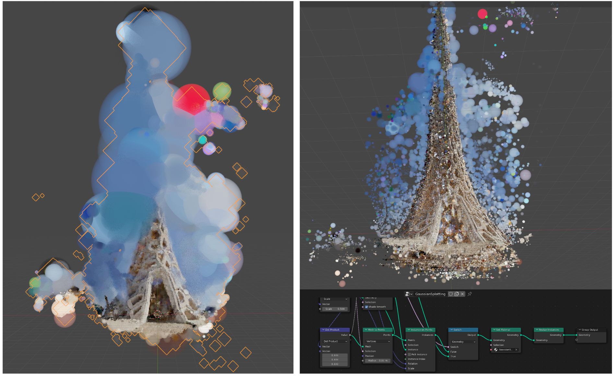
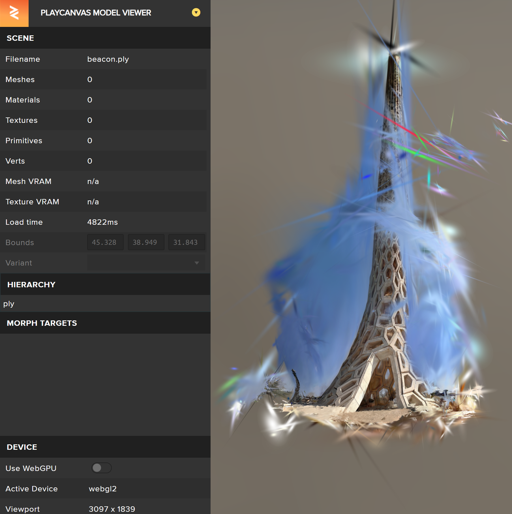
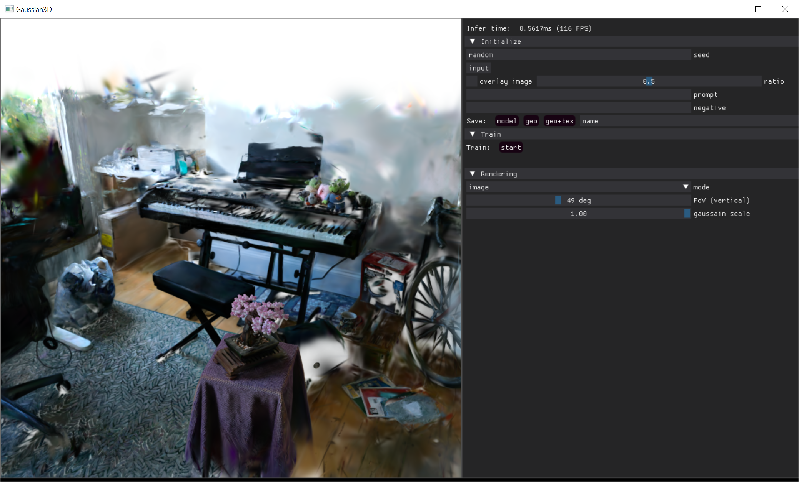
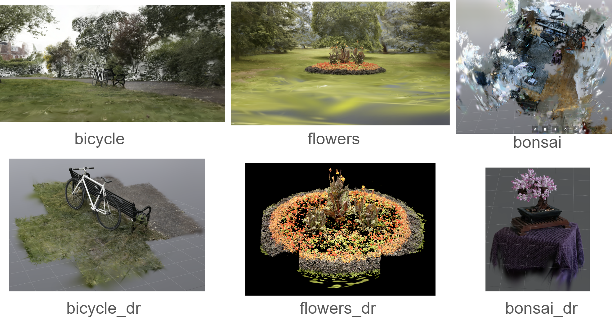
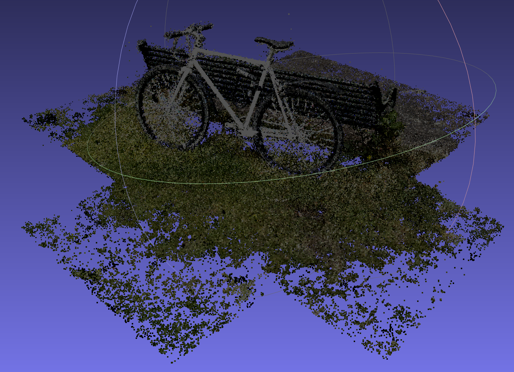
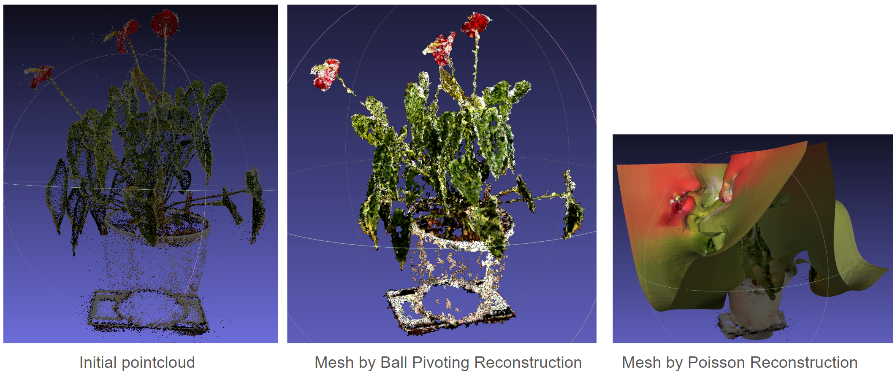
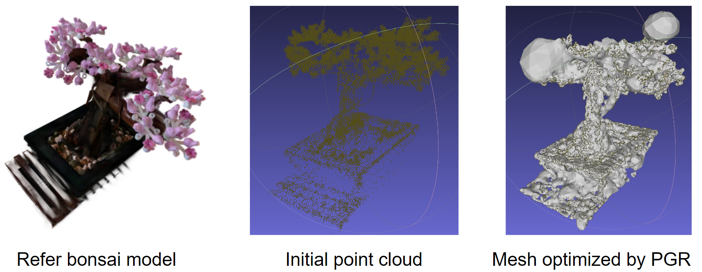

This repository is forked from the [repository](https://github.com/graphdeco-inria/gaussian-splatting), which is the source code for the best paper [3D Gaussian Splatting for Real-Time Radiance Field Rendering](https://repo-sam.inria.fr/fungraph/3d-gaussian-splatting/) in SIGGRAPH 2023.

Followed up papers are updated [here](https://github.com/MrNeRF/awesome-3D-gaussian-splatting).

## Installing and running
The installation can refer to a step-by-step [Youtube tutorial](https://www.youtube.com/watch?v=UXtuigy_wYc).

<details>
<summary><span style="font-weight: bold;">Installation steps in Anaconda</span></summary>

  - open Anaconda Prompt
  - cd C:User/<username>
  - git clone https://github.com/graphdeco-inria/gaussian-splatting --recursive
  - SET DISTUTILS_USE_SDK=1
  - conda env create --file environment.yml
  - conda activate gaussian_splatting
  #### Below packages may be needed
  - conda install -c conda-forge pillow
  - python3 -m pip install -U pip
  - python3 -m pip install pillow-heif
  - conda install -c conda-forge pcl
  - conda install -c open3d-admin open3d
  - conda install -c anaconda numpy
  #### if error: Importing the numpy C-extensions failed.
  - pip install setuptools
  - pip install numpy
  - pip install cupy
  - pip install probreg
  - pip install pillow-heif

</details>

<details>
<summary><span style="font-weight: bold;">Running in Anaconda Prompt</span></summary>

  - open Anaconda Prompt
  - conda activate gaussian_splatting
  - cd C:\User\<username>\gaussian-splatting
  - put images in the folder data/input
  - python convert.py -s data (wait within 5 mins)
  - python train.py -s data (wait around 1h)
  - output GaussianSplatting ply appears in the folder output/<name>
  - rename <name> to out
  - cd viewers/bin
  - SIBR_gaussianViewer_app.exe -m C:\Users\<username>\gaussian-splatting\output\out 
  - the GUI pops up, if not, may the CUDA support problem.

</details>
<br>

## Visualization
The default viewer is by SIBR. Other viewers are developing gradually. 
I test several viewers, including SIBR, Unity, Blender, PlayCanvas and viewer in DreamGaussian, and comment the comparsion between them as seen below:

SIBR Viewer
- Source: default viewer from the paper
- Pros.: focused view of the object when opening
- Cons.: need keyboard to navigate, mouse control is so bad even freezes the GUI
  
https://github.com/WWmore/gaussian-splatting/assets/28695253/d1d8aaeb-a890-434e-95b8-acf526bea44b
  

Unity Viewer
- Source: [Unity](https://github.com/aras-p/UnityGaussianSplatting) (free-to-use) 
- Pros.: can directly trim the Gaussian Splatting in the scene and export the ply; parameters are interactivly set
- Cons.: global view of the whole scene; tilt basement; need mouse to zoom in-out; hard to control
  
https://github.com/WWmore/gaussian-splatting/assets/28695253/21ccd9fd-ef3e-4a74-817f-f2dcd27ae661


Blender Viewer
- Source: [Blender addon](https://github.com/ReshotAI/gaussian-splatting-blender-addon) in Github
- Pros.: presented as point-cloud; can directly edit(trim) in the scene and export; controlled size
- Cons.: low resolution; only presented in render view by Cycles; slow process




PlayCanvas Viewer
- Source: [PlayCanvas](https://github.com/playcanvas/model-viewer) online
- Pros.: directly import .ply to show online; high resolution; easy navigation; suitable to share
- Cons.: no editting(trim)




DreamGaussian Viewer
- Source: [DreamGaussian](https://github.com/dreamgaussian/dreamgaussian) viewer
- Pros.: import .ply to navigate; three modes: image, depth, alpha to show
- Cons.: no editting(trim); can save a mesh with texture, but very bad quality




## Cleaning noisy splatters

There have been several ways to delete unwanted splatters by GUI, such as [Unity](https://github.com/aras-p/UnityGaussianSplatting), [Blender Plugin](https://github.com/ReshotAI/gaussian-splatting-blender-addon/tree/master), [SuperSplat](https://github.com/playcanvas/super-splat) and so on. 

Or running the code:
```bash
python 3dgsconverter.py -i input_3dgs.ply -o output_dr.ply -f cc --density_filter --remove_flyers
```
where `input_3dgs.ply` is the input path to the Gaussian Splatting .ply file and `output_dr.ply` is the output path to the trimmed one by filtering (`density_filter`) the region with higher point density and removing (`remove_flyers`) the lower ones.




## GS to pointcloud with colors

Running the code:
```bash
python 3dgsconverter.py -i input_3dgs.ply -o output_cc.ply -f cc --rgb
```
where input Gaussian Splatting `input_3dgs.ply` is produced to be pointcloud `output_cc.ply` with colors.

Together with the cleaning process, this process can be organized by one commond:
```bash
python 3dgsconverter.py -i input_3dgs.ply -o output_drcc.ply -f cc --density_filter --remove_flyers --rgb
```

Pointcloud `output_drcc.ply` can be visualized in MeshLab:


If one wants to turn the pointcloud back to Gaussian Splatting, run below:
```bash
python 3dgsconverter.py -i input_drcc.ply -o output_drcc_3dgs.ply -f 3dgs
```

* Note: But if one continues to repeat the deleting process, it won't work (the produced `_dr.ply` file is the same).

## Pointcloud to mesh with texture

There stil an open problem about reconstruction a good mesh with texture from pointcloud produced from 3D Gaussian Splattings. 
Below are some tryings.

### Open3D
There are three ways `Alpha Shapes [Edelsbrunner1983]`, `Ball Pivoting [Bernardini1999]`, and `Poisson Surface Reconstruction [Kazhdan2006]` to reconstruct a mesh from pointcloud, however they all need the vertex normal information.

### MeshLab
MeshLab also has the famous `Poisson Surface Reconstruction [Kazhdan2006]` function to reconstruct a mesh, however the produced one is far away from the ideal one.

Function `Ball Pivoting [Bernardini1999]` can help to produce one, but it is quite messy with some parts missing.


### Parametric Gauss Reconstruction
As introduced in the paper [Surface Reconstruction from Point Clouds without Normals by Parametrizing the Gauss Formula (SIGGRAPH 2023)](https://jsnln.github.io/tog2022_pgr/index.html), the method `PGR` can help to reconstruct a mesh from pointcloud without normals.
However, the test one [shows](https://github.com/WWmore/ParametricGaussRecon) the result is not good.


